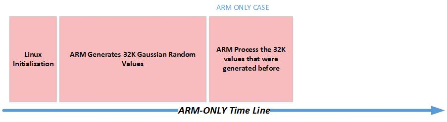
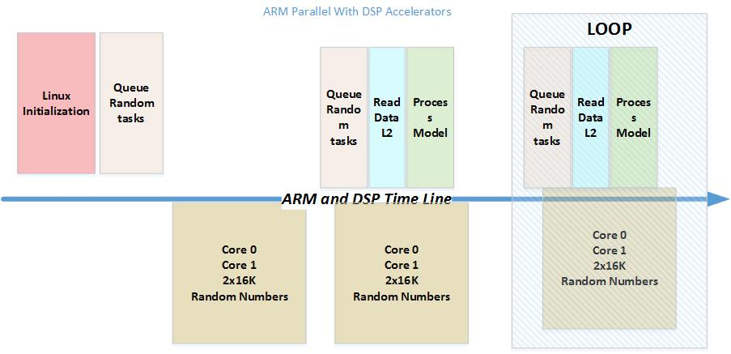

*******************
Monte Carlo example
*******************

This example illustrates the usage of DSPs for Monte-Carlo simulation from a Linux OpenCL program running on the ARM Cortex-A15 CPU.  Monte-Carlo simulation is a common used tool in many fields such as physics, communications, public utilities and financing. Generating long Normal (Gaussian) distributed random number sequence is an essential part of many Monte-Carlo simulations. However, the computational load required to generating long normal distributed random sequence is substantial and in many models it consumes most of the CPU cycles. DSP accelerators were designed to efficiently execute digital signal algorithms such as the generation of random sequence.

Algorithm for Gaussian Random Number Generation
-----------------------------------------------

Introduction to Generating Normal distributed Random sequence
~~~~~~~~~~~~~~~~~~~~~~~~~~~~~~~~~~~~~~~~~~~~~~~~~~~~~~~~~~~~~

True Random Number Generation is generated by special hardware (TI's Security Accelerator IP has a true random number generation). Pseudo Random Number Generation (PRNG) can be generated by software; it has limited "randomness".
Several methods to generate uniformly distributed random sequence are known in literature. A commonly use method is the Linear Congruential Generator (LCG) method. The LCG starts with an initial seed and generates random sequence based on the following formula:

.. math:: Xn+1 = (a*Xn+c) Mod (M)

Where :math:`X0` is a seed, M is the modulo, a is the multiplier and c is increment. Under certain condition, the length of the sequence, meaning the number of random numbers before the sequence starts repeating itself, is M-1.  Using formula (1) generates numbers pseudo uniformly distributed between 1 and M. It is easy to scale LCG sequence to a uniformly distributed sequence in the range of [-1, 1].

To convert uniformly distributed random sequence into a normal Gaussian random sequence the program uses the polar form of the Box-Muller transformation. See (http://www.design.caltech.edu/erik/Misc/Gaussian.html).

The Normal Gaussian distribution has two parameters, the average and the standard deviation

For a sequence of N random variables :math:`X (n), n=1, ... N`

 * The average (or E(X) ) :math:`\mu = \sum X(n) ) / N`
 * Standard Deviation :math:`\sigma = sqrt[E(X - m)2]`

For standard normal distribution case :math:`\mu` = 0 and :math:`\mu` = 1.
Common algorithm to get Gaussian random variables from uniformly distributed random variable is the following:

::

   Get two uniformly distributed (-1.0, 1.0), x and y
   Calculate w = x*x + y*y
   If  w < 1.0 do the following:
       w = sqrt( (-2.0 * log( w ) ) / w );
       y1 = x * w;
       y2 = y * w;

y1 and y2 are two Normal distributed random values .

Randomness, sequence length and parallel computation
~~~~~~~~~~~~~~~~~~~~~~~~~~~~~~~~~~~~~~~~~~~~~~~~~~~~
Multiple tests were suggested in the literature for the "randomness" of a Normal Random sequence:
  * Have the correct distribution (lim (1/n * S (X(n)) ~ N(0,1)
  * No predictability (After reaching the length of the sequence starts to repeat itself, so the longer the sequence, the better)
  * Auto-Correlation goes to infinite, cross correlation goes to zero
               :math:`(lim (S (X(n) * X(n)) \to \infty)`

               :math:`(lim (S (X(n) * X(n-k)) \to  0 )`
  * Measure the Entropy - lack of order or predictability; For a finite sequence X, the entropy can be defined as the following.  (see for example the discussion  at http://www.cryptosys.net/rng_algorithms.html#topofpage)

The issue of how to choose the constants a, M and c and the initial seed x0 to achive good "randomness" features is discussed in many publication, see (  http://www.mi.fu-berlin.de/inf/groups/ag-tech/teaching/2012_SS/L_19540_Modeling_and_Performance_Analysis_with_Simulation/06.pdf) for example. Thus the constants a and M of formula were chosen to ensure a long pseudo random sequence.

In addition, for the example to utilize the full power of the multiple DSP accelerators, the merging together of multiple independent random sequences into a single random sequence and still preserve the good "randomness" attributes is an issue.  Reference (https://www.siam.org/pdf/news/744.pdf) suggest a method of choosing the additive constant c for parallel generation. Accordingly, this program uses set  of prime numbers for parallel generating of Normal random sequence.

OpenCL Implementation
~~~~~~~~~~~~~~~~~~~~~
In this example, the DSP accelerator code is developed using ANSI C language.

Kernel Code design
~~~~~~~~~~~~~~~~~~
This example uses C++ for the OpenCL APIs and OpenCL C for kernel code running on the DSPs. The OpenCL kernel code contains calls to C code implementing the random number generator.
The kernel code can be presented as an ASCII string or in separate C file or files. The compilation of the kernel string is done during run time by the system. The compilation of C files is done during the build process but linking the code and getting executable from the compiled files are done during run time. This process increases the OpenCL run-time over-head but the big advantage for the user is that it makes the OpenCL portable to any OpenCL device, regardless of what type of accelerators the device has, and any memories and device data movement architecture in the device. This is a great advantage for users who try to benchmark their application over multiple devices and for users who plan to scale or update the application.

Executing the code
------------------
The algorithm generates a sequence of Gaussian Random values with mean of zero and standard deviation of 1, and then runs a model simulation using the generated sequence. In this demo program the model simulation builds a histogram of values that are less or more than zero.
The ARM generates 32K of Gaussian values and then processes the values as described above. The code is executed serially.
Then, the Gaussian Random variables are generated by the DSP accelerators while at the same time the ARM processes the previous set of Gaussian Random values that were generated before. Thus to get the full entitlement of the execution, a loop is built.

The following two figures show the processing time-line of the two algorithms:

Sample Output
-------------

::

    ./monte_carlo

    This code generates Gaussian Random Numbers (0,1)
     and then processes them

    The ARM code generates 32K numbers on the ARM
    and then processes them
      (calculate how many numbers are less than 0 and more than 0

    The ARM ONLY code work serially
    The OpenCL code uses the DSP cores parallel to the ARM CPU

    While the DSP cores prepare a new set of Gaussian Random number
    The ARM core processes the previous set of Random Numbers

     we time the average number of cycles that is used
     For ARM ONLY we run the algorithm only ONCE
    Because it is serial multiple  runs will not change
     the average time

    For the OpenCL case, since the DSP cores are working
    in parallel with the ARM, we run multiple itrations
    And print out the average time for each value in each iteration
     count positive =  16268  count Negative = 16500 zero  0
    ARM Only, Total time 3244650.00 nanoseconds
              99.02 nanoseconds per element
              32768 elements processed
    ARM + DSP, Total time 322000.00 nanoseconds
               9.83 nanoseconds per element
               32768 elements processed
     count positive =  16336  count Negative = 16432 zero  0
    ARM + DSP, Total time 260000.00 nanoseconds
               7.93 nanoseconds per element
               32768 elements processed
     count positive =  16493  count Negative = 16275 zero  0
    ARM + DSP, Total time 263000.00 nanoseconds
               8.03 nanoseconds per element
               32768 elements processed
     count positive =  16507  count Negative = 16261 zero  0
    ARM + DSP, Total time 257000.00 nanoseconds
               7.84 nanoseconds per element
               32768 elements processed
     count positive =  16399  count Negative = 16369 zero  0
    ARM + DSP, Total time 273000.00 nanoseconds
               8.33 nanoseconds per element
               32768 elements processed
     count positive =  16457  count Negative = 16311 zero  0
    ARM + DSP, Total time 272000.00 nanoseconds
               8.30 nanoseconds per element
               32768 elements processed
     count positive =  16243  count Negative = 16525 zero  0
    ARM + DSP, Total time 262000.00 nanoseconds
               8.00 nanoseconds per element
               32768 elements processed
     count positive =  16446  count Negative = 16322 zero  0
    ARM + DSP, Total time 259000.00 nanoseconds
               7.90 nanoseconds per element
               32768 elements processed
     count positive =  16456  count Negative = 16312 zero  0
    ARM + DSP, Total time 266000.00 nanoseconds
               8.12 nanoseconds per element
               32768 elements processed
     count positive =  16204  count Negative = 16564 zero  0

    END RUN!

