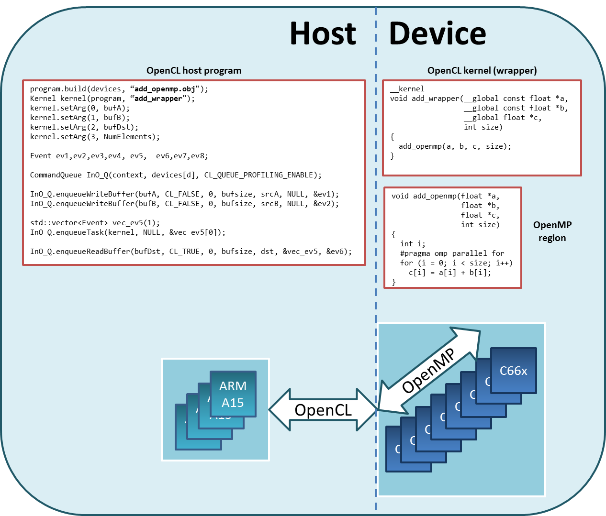

OpenMP dispatch from OpenCL
***************************

An OpenCL program consists of a *host program* that executes on the host, and 
*kernels* that execute on OpenCL devices. A TI extension allows an OpenCL kernel
to act as a wrapper that invokes C functions containing *OpenMP regions*. These 
three components  - the host program, the OpenCL kernel, and the OpenMP region 
- form the main parts of an OpenCL program capable of dispatching OpenMP regions.

The figure below provides an overview of how OpenMP regions are dispatched using
OpenCL APIs. The host program is executed on SMP Linux running on the
ARM Cortex-A15, while the OpenCL kernel and OpenMP region is executed on a 
OpenCL device consisting of the DSPs. The OpenCL kernel invokes the OpenMP 
main thread on DSP Core 0. When an OpenMP region is encountered while executing
the main thread, DSP Core 0 along with the other DSPs work together to execute
the OpenMP region.

Structure of an OpenCL + OpenMP Application
===========================================
This section uses the :doc:`vecadd\_openmp <../examples/overview>`
example in the OpenCL package to describe the structure of an OpenCL + OpenMP application.

Host Code
---------

The host code is responsible for setting up and managing the execution
of kernels on OpenCL devices.

A host code for a typical OpenCL + OpenMP application starts
with creating an OpenCL context. A context facilitates the creation of
programs and kernels, creation of command queues, management of memory
between the host and DSP, and submission of kernels for execution on the
device.

The following host code for the example vadd\_openmp application
illustrates the responsibilities of the host code.

::

    ...
    float srcA  [NumElements];
    float srcB  [NumElements];
    float dst   [NumElements];
    float Golden[NumElements];
    ...

    // Create a context with the DSP device
    Context context(CL_DEVICE_TYPE_ACCELERATOR);

    // Get information about the device associated with the context
    std::vector<Device> devices = context.getInfo<CL_CONTEXT_DEVICES>();
    std::string str;
    devices[d].getInfo(CL_DEVICE_NAME, &str);
    cout << "DEVICE: " << str << endl << endl;

    // Create input and output buffers
    Buffer bufA(context, CL_MEM_READ_ONLY,  bufsize);
    Buffer bufB(context, CL_MEM_READ_ONLY,  bufsize);
    Buffer bufDst(context, CL_MEM_WRITE_ONLY, bufsize);

    ifstream t("vadd_wrapper.cl");
    std::string kSrc((istreambuf_iterator<char>(t)), istreambuf_iterator<char>());

    // Create a program from the kernel source code
    Program::Sources source(1, make_pair(kSrc.c_str(), kSrc.length()));
    Program program = Program(context, source);

    // Compile the kernel source and link it with the specified object file
    program.build(devices, "vadd_openmp.obj");

    // Specify which kernel from the program to execute
    Kernel kernel(program, "vadd_wrapper");

    // Set the argument list for the kernel command
    kernel.setArg(0, bufA);
    kernel.setArg(1, bufB);
    kernel.setArg(2, bufDst);
    kernel.setArg(3, NumElements);

    Event ev1,ev2,ev3,ev4,ev5,ev6,ev7,ev8;

    // Create command queue using the context and device
    CommandQueue InO_Q(context, devices[d], CL_QUEUE_PROFILING_ENABLE);

    // Enqueue commands to copy data into the input buffers
    InO_Q.enqueueWriteBuffer(bufA, CL_FALSE, 0, bufsize, srcA, NULL, &ev1);
    InO_Q.enqueueWriteBuffer(bufB, CL_FALSE, 0, bufsize, srcB, NULL, &ev2);

    std::vector<Event> vec_ev5(1);

    // Enqueue the kernel for execution as an OpenCL task
    InO_Q.enqueueTask(kernel, NULL, &vec_ev5[0]);

    // Enqueue command to copy results from out of the output buffer
    InO_Q.enqueueReadBuffer(bufDst, CL_TRUE, 0, bufsize, dst, &vec_ev5, &ev6);

Kernels that invoke OpenMP applications must be enqueued to an
**in-order command queue**. In-order execution serializes the execution
order of commands in a command queue, and therefore ensures that only
one "OpenMP" kernel is executed by a device at a time.

Observe that the host enqueues commands to write to *bufA* and *bufB*
(from *srcA* and *srcB* residing on the host) before the enqueuing the
kernel. This ensures that the data transfers complete before execution
of the OpenCL kernel begins. When the kernel completes execution, the
command to read from *bufDst* to *dst* (residing on the host) runs.

For OpenCL + OpenMP applications, kernels are dispatched as **OpenCL
tasks**. Only a single instance of the kernel is executed by one of the
DSPs.

Kernel
------

Kernels in OpenCL + OpenMP applications are essentially wrappers that
call functions containing OpenMP regions. In the vecadd\_openmp example,
the *vadd\_wrapper* kernel calls *vadd\_openmp* (which contains an
OpenMP region) after initializing c[]. Note that the kernel is initially
executed by a one DSP, until the OpenMP region is encountered.

.. code:: c

    __kernel void vadd_wrapper(__global const float *a, 
                               __global const float *b, 
                               __global       float *c, 
                                              int    size)
    {
      vadd_openmp(a, b, c, size);
    }

C Function with OpenMP regions
------------------------------

OpenMP directives are used to express and guide parallelism. In the
vadd\_openmp function, the directive before the for loop indicates that
the chunks of loop may be distributed and concurrently executed by
multiple cores.

.. code:: c

    void vadd_openmp(float *a, float *b, float *c, int size)
    {
      int i;
      #pragma omp parallel for
      for (i = 0; i < size; i++)
        c[i] = a[i] + b[i];
    }

.. note::
    The C6000 compiler supports OpenMP directives only
    for C code. OpenMP directives in C++ are not supported.

Makefile
--------

The Makefile defines the rules for building and cleaning the executable.
At the minimum, it specifies the host and device compilers, compiler
flags, and the linker options.

For the vecadd\_openmp example, the host code and the OpenMP DSP code are
compiled separately by the gcc and C6000 compilers, respectively. The ``--omp`` 
C6000 compiler flag is specified to enable OpenMP compilation
for DSP code.

.. code:: make

    # Host compiler and compile flags/options. Used to compile host code
    CXX   = g++ $(HOST_INCLUDE)
    CXX_FLAGS  = -O3
    HOST_INCLUDE = -I$(TI_OCL_INSTALL)/include

    # Device OpenMP compiler and compile flags/options. Used to compile OpenMP code for device
    CL6X  = cl6x -mv6600 --abi=eabi $(DSP_INCLUDE)
    CL6X_FLAGS = -O1 --omp
    DSP_INCLUDE  = -I$(TI_OCL_CGT_INSTALL)/include

    # linker options and libraries for final executable
    LIBS  = -L$(TI_OCL_INSTALL)/lib -lOpenCL -locl_util

    # rule for building final executable
    EXE        = vecadd_openmp
    $(EXE): main.o vadd_openmp.obj
            @$(CXX) $(CXX_FLAGS) main.o $(LIBS) -o $@

    # rules for compiling host C/C++ code
    %.o: %.cpp
            @$(CXX) -c $(CXX_FLAGS) $<
            @echo Compiling $<
    %.o: %.c
            @$(CXX) -c $(CXX_FLAGS) $<
            @echo Compiling $<

    # rule for compiling OpenMP C code for device
    %.obj: %.c
            @$(CL6X) -c $(CL6X_FLAGS) $<
            @echo Compiling $<

Guidelines for writing OpenCL + OpenMP applications
===================================================

Using OpenCL kernels to dispatch OpenMP regions is a
TI-specific extension to OpenCL. The following are guidelines for
writing applications in this mode.

-  The C6000 compiler currently supports the OpenMP 3.0
   specification for C. OpenMP directives in C++ are not supported.
   See the `OpenMP website <http://www.openmp.org/>`__ for the complete
   C language specification for the OpenMP Application Program Interface
   Version 3.0.
-  OpenMP threadprivate variables are not supported.
-  Only one level of parallelism is available in the OpenMP DSP runtime.
   Therefore, nested parallel regions will be executed by teams
   comprising only one thread.
-  OpenMP environment variables are not supported and have no effect on
   the OpenMP runtime behavior.
-  OpenMP timing routines (omp\_get\_wtime, omp\_get\_wtick) assume that
   the DSP cores are running at 1 GHz.
-  The configuration of the OpenMP runtime in OpenCL reserves 10KB of
   memory for each core's stack. Since stack sizes are small, avoid
   placing large arrays/structs on the stack. Also, keep the call stack
   short to avoid stack overruns.
-  The current configuration of the OpenMP runtime reserves 8MB of
   memory for the shared heap. Since this heap size is quite small,
   avoid dynamic memory allocation (using mallocs). Alternatively,
   create OpenCL buffers on the host & pass them as arguments to
   kernels.
-  By default, global variables are placed in DDR.

| 
